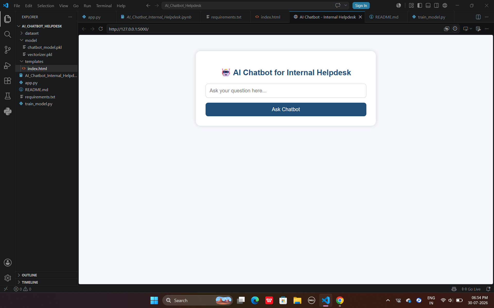
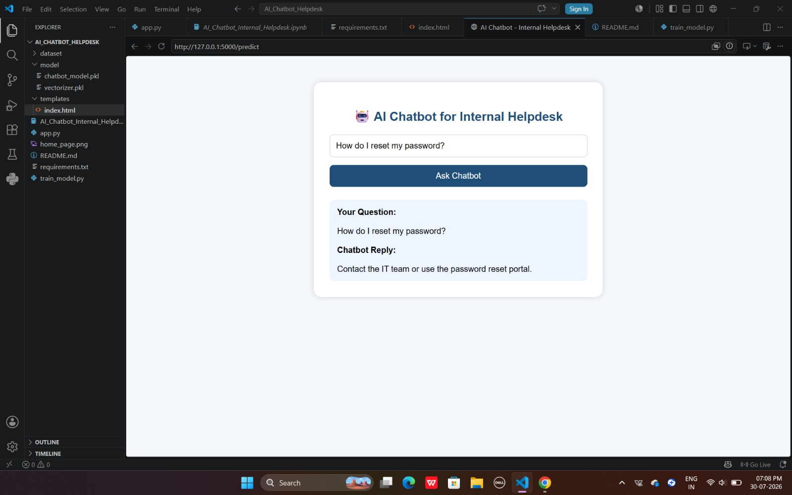
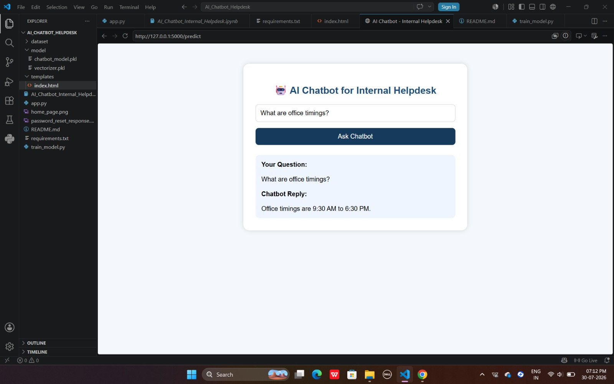
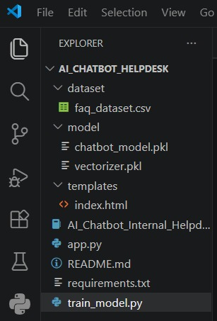
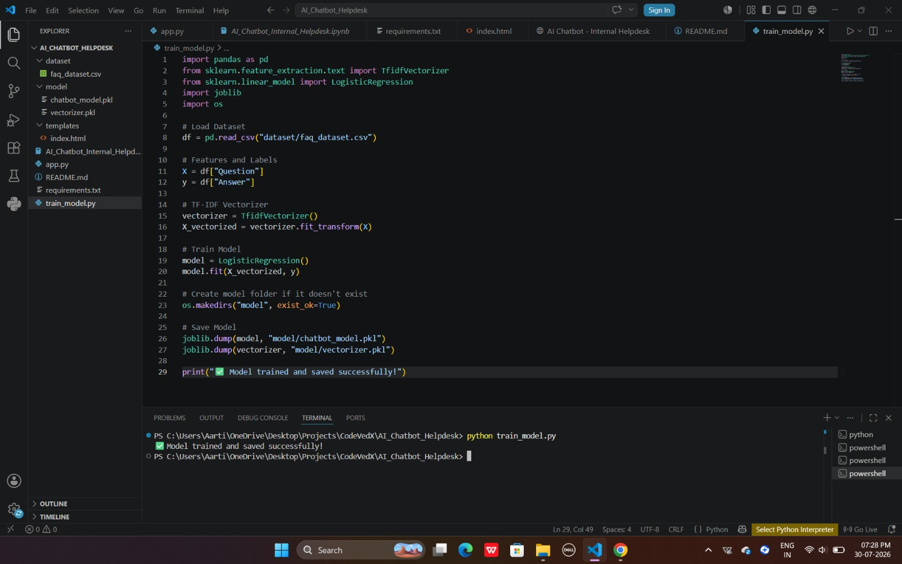
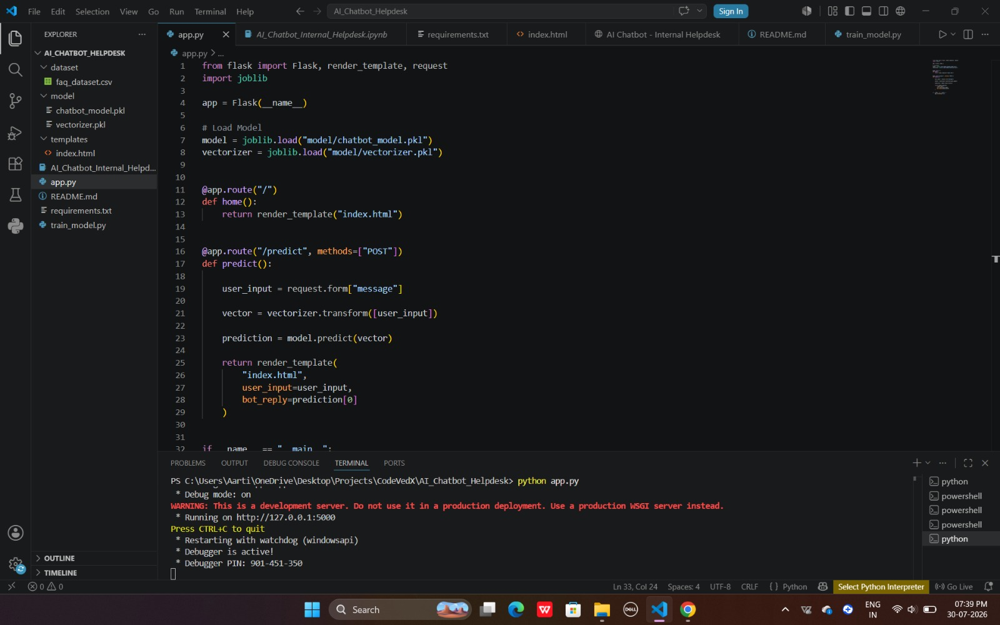

# 🤖 AI Chatbot for Internal Helpdesk

An AI-powered FAQ chatbot built using **Natural Language Processing (NLP)**, **Machine Learning**, and **Flask**. The chatbot understands user queries and provides relevant responses based on a trained FAQ dataset.

---

## 📌 Project Overview

The **AI Chatbot for Internal Helpdesk** is designed to answer frequently asked employee questions such as office timings, leave requests, password reset, attendance, and HR-related queries.

The project demonstrates the complete workflow of building an NLP-based chatbot, including:

- Dataset creation
- Text preprocessing
- Feature extraction using TF-IDF
- Machine Learning model training
- Flask web application deployment

---

## ✨ Features

- 🤖 AI-powered FAQ Chatbot
- 💬 Instant response to employee queries
- 📚 FAQ dataset support
- 🔍 TF-IDF text vectorization
- 🧠 Logistic Regression model
- 🌐 Flask-based web interface
- 💾 Model saving using Joblib
- 🎯 Simple and user-friendly interface

---

## 🛠️ Technologies Used

- Python
- Flask
- Pandas
- Scikit-learn
- TF-IDF Vectorizer
- Logistic Regression
- Joblib
- HTML
- CSS

---

# 📂 Project Structure

```text
AI_Chatbot_Helpdesk
│
├── dataset/
│   └── faq_dataset.csv
│
├── model/
│   ├── chatbot_model.pkl
│   └── vectorizer.pkl
│
├── screenshots/
│   ├── home_page.png
│   ├── password_reset_response.png
│   ├── office_timings_response.png
│   ├── leave_request_response.png
│   ├── project_structure.png
│   ├── training_model.png
│   └── flask_running_terminal.png
│
├── templates/
│   └── index.html
│
├── app.py
├── train_model.py
├── requirements.txt
└── README.md
```

---

# 📊 Machine Learning Workflow

1. Create FAQ Dataset
2. Load Dataset using Pandas
3. Text Preprocessing
4. TF-IDF Feature Extraction
5. Train Logistic Regression Model
6. Save Model & Vectorizer
7. Load Model in Flask
8. Predict User Query
9. Display Chatbot Response

---

# 🤖 Machine Learning Algorithm

**Logistic Regression**

The chatbot converts user questions into numerical vectors using **TF-IDF Vectorization** and predicts the most relevant response using a trained Logistic Regression model.

---

# ▶️ Installation

### Clone the repository

```bash
git clone https://github.com/aartiprajapati-ai/CODEVEDX.git
```

### Navigate to the project folder

```bash
cd AI_Chatbot_Helpdesk
```

### Install dependencies

```bash
pip install -r requirements.txt
```

---

# ▶️ Train the Model

```bash
python train_model.py
```

---

# ▶️ Run the Application

```bash
python app.py
```

Open your browser and visit:

```
http://127.0.0.1:5000
```

---

# 📸 Screenshots

## 🏠 Home Page



---

## 🔐 Password Reset Response



---

## 🕒 Office Timings Response



---

## 📝 Leave Request Response


---

## 📂 Project Structure



---

## 🧠 Model Training



---

## 💻 Flask Application Running



---

# 📌 Future Improvements

- Voice-enabled chatbot
- Database integration
- User authentication
- Admin dashboard
- Multi-language support
- Advanced intent recognition using Deep Learning
- Integration with company knowledge base

---

# 👩‍💻 Author

**Aarti Prajapati**

**B.Tech – Computer Science & Engineering (Artificial Intelligence & Machine Learning)**

**IIMT University, Meerut, Uttar Pradesh**

---

## ⭐ Support

If you found this project helpful, consider giving it a **⭐ Star** on GitHub.

Thank you for visiting this repository!
