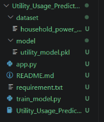
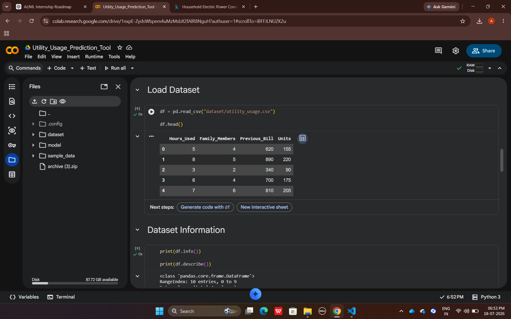
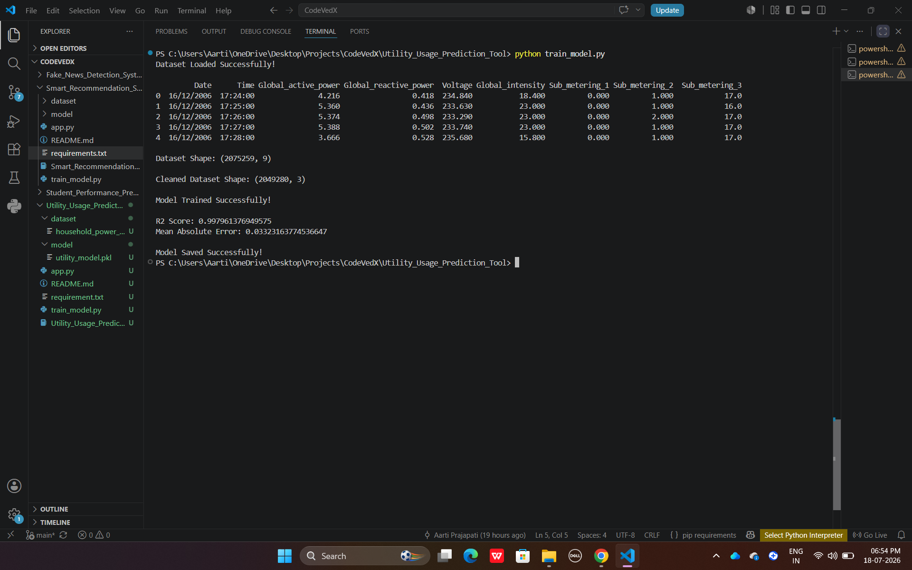
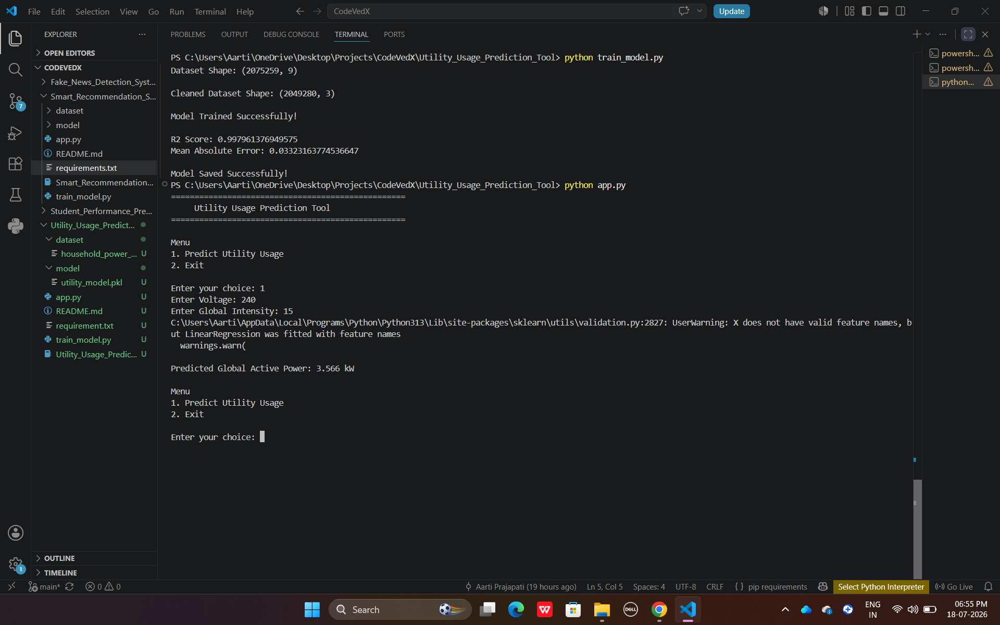

# ⚡ Utility Usage Prediction Tool

A Machine Learning project that predicts household electricity usage using Linear Regression.

---

# 📌 Project Overview

The Utility Usage Prediction Tool is a Machine Learning project that predicts household electricity consumption based on electrical measurements such as Voltage and Global Intensity.

The project demonstrates the complete Machine Learning workflow, including data preprocessing, model training, evaluation, and prediction.

---

# 🚀 Features

- Console-based application
- Data preprocessing
- Machine Learning prediction
- Linear Regression model
- Model saving using Joblib
- Exception handling

---

# 🛠 Technologies Used

- Python
- Pandas
- NumPy
- Scikit-learn
- Joblib

---

# 📂 Project Structure

```
Utility_Usage_Prediction_Tool
│
├── dataset/
├── model/
│   └── utility_model.pkl
├── screenshots/
│   ├── folder_structure.png
│   ├── dataset_preview.png
│   ├── model_training.png
│   └── prediction_output.png
├── app.py
├── train_model.py
├── requirements.txt
├── README.md
└── Utility_Usage_Prediction_Tool.ipynb
```

---

# 📊 Machine Learning Workflow

- Load Dataset
- Data Cleaning
- Feature Selection
- Train-Test Split
- Train Linear Regression Model
- Evaluate Model
- Save Trained Model
- Predict Utility Usage

---

# 🤖 Machine Learning Algorithm

- Linear Regression

---

# ▶️ Installation

Clone the repository

```bash
git clone https://github.com/aartiprajapati-ai/CODEVEDX.git
```

Go to project folder

```bash
cd Utility_Usage_Prediction_Tool
```

Install required libraries

```bash
pip install -r requirements.txt
```

---

# ▶️ Train the Model

```bash
python train_model.py
```

---

# ▶️ Run the Application

```bash
python app.py
```

---

# 📸 Screenshots

## 📁 Project Structure



---

## 📊 Dataset Preview



---

## 🤖 Model Training



---

## ⚡ Prediction Output



---

# 📁 Dataset

The original dataset is larger than GitHub's file size limit (100 MB), so it is **not included** in this repository.

You can download it from the **UCI Machine Learning Repository** and place it in the following directory:

```
Utility_Usage_Prediction_Tool/dataset/
```

Dataset Name:

```
household_power_consumption.txt
```

---

# 📌 Future Improvements

- Streamlit Web Application
- Interactive Dashboard
- Better Prediction Accuracy
- More Machine Learning Algorithms

---

# 👩‍💻 Author

**Aarti Prajapati**

B.Tech CSE (Artificial Intelligence & Machine Learning)

IIMT University, Meerut

---

# ⭐ If you like this project, don't forget to give it a Star on GitHub!